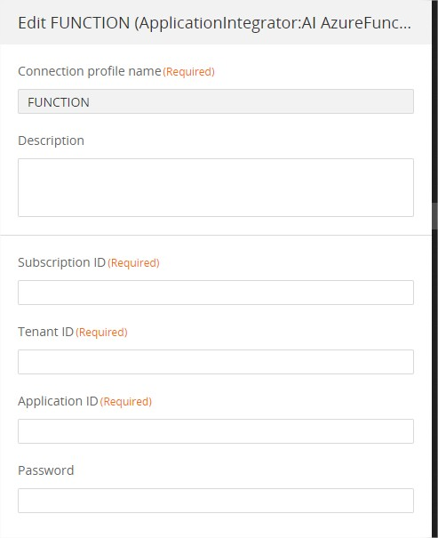
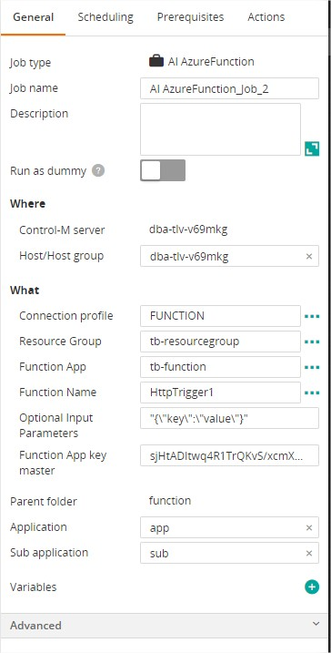
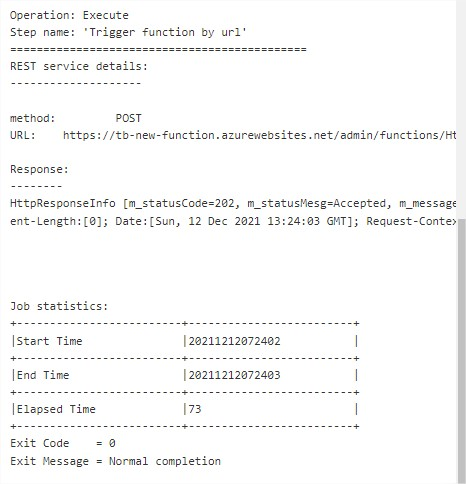
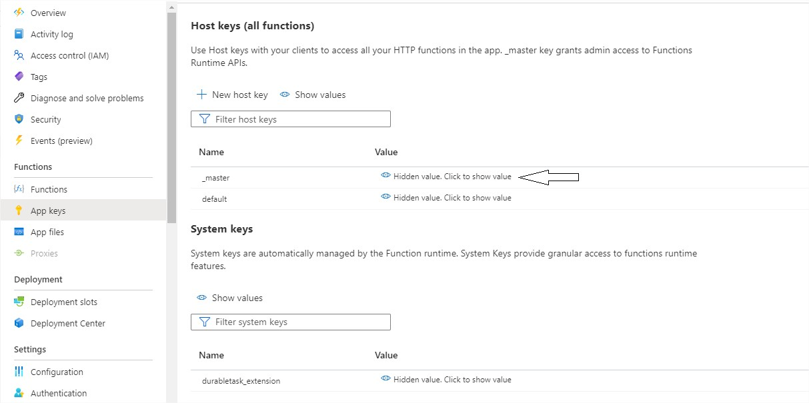

# Control-M Azure Function Apps plugin
Version 1.0.0

### Short description:
Control-M Integration plugin for Azure Function Apps.

Created on 13-Dec-2021

### Detailed description:

The Azure Function Apps plugin for Control-M enables the integration of Function Apps with your existing Control-M
workflows.

This folder contains sample Application Integrator jobtypes for running and monitoring Azure Function Apps, a Microsoft Azure cloud service that helps to integrate apps, data, systems, and services across enterprises or organizations.

Trigger and monitor Function Apps with this integration. Authentication can be handled by Service Principal
and Managed Identity.

#### Pre requisites

Control-M Version 9.0.20.200

Note: This plugin is not compatible with BMC Helix Control-M

#### Features

* #### 1. External application authentication.
* #### 2. Execute an Azure Function with triggers.
* #### 3. Return the results of the workflow steps to the output in the Control-M Monitoring domain.
* #### 4. Integrate Function apps processes with all existing Control-M capabilities.  

 
#### 1. Connection profile 




| Field | Value |
| --- | --- |
| Subscription ID	 | Azure subscription id of the Function App you wish to run|
| Tenant ID	 | Azure tenant ID of the Function App|
| Application ID	 | Azure App Registration (also known as Service Principal) that has permission to run the desired Function App|
| Password	 | An active secret for the Application ID above (Client Secret)|

#### 2. Locig Apps Job Definition - Trigger workflow with parameters.
Once a connection profile is selected, you can use the elipsis (...) next to each field to retrieve from Azure the available values for each field and you can select the desired one from the list.



#### 3. Return the results of the workflow steps to the output in the Control-M Monitoring domain.  




#### Automation API input requirements
Variants of Connection profile information
```json
{
  "FUNCTION": {
    "Type": "ConnectionProfile:ApplicationIntegrator:AI AzureFunction",
    "AI-Subscription ID": "<AI-Subscription ID>",
    "AI-Password": "*****",
    "AI-Application ID": "<AI-Application ID>",
    "AI-Tenant ID": "<AI-Tenant ID>",
    "Description": "",
    "Centralized": true
  }
}
```

Job Definition
```json
{
  "function": {
    "Type": "SimpleFolder",
    "ControlmServer": "dba-tlv-v69mkg",
    "OrderMethod": "Manual",
    "AI AzureFunction_Job_2": {
      "Type": "Job:ApplicationIntegrator:AI AzureFunction",
      "ConnectionProfile": "FUNCTION",
      "AI-Function App": "functionapp",
      "AI-Function Name": "HttpTrigger1",
      "AI-Optional Input Parameters": "{\"key\":\"value\"}",
      "AI-Function App key master": "<AI-Function App key master>",
      "SubApplication": "sub",
      "Host": "dba-tlv-v69mkg",
      "CreatedBy": "emuser",
      "RunAs": "FUNCTION",
      "Application": "app",
      "When": {
        "WeekDays": [
          "NONE"
        ],
        "MonthDays": [
          "ALL"
        ],
        "DaysRelation": "OR"
      }
    }
  }
}
```

####get AI-Function App key master

GO to Azure portal --> Function APP--> App keys 
copy the "_master" value

 

