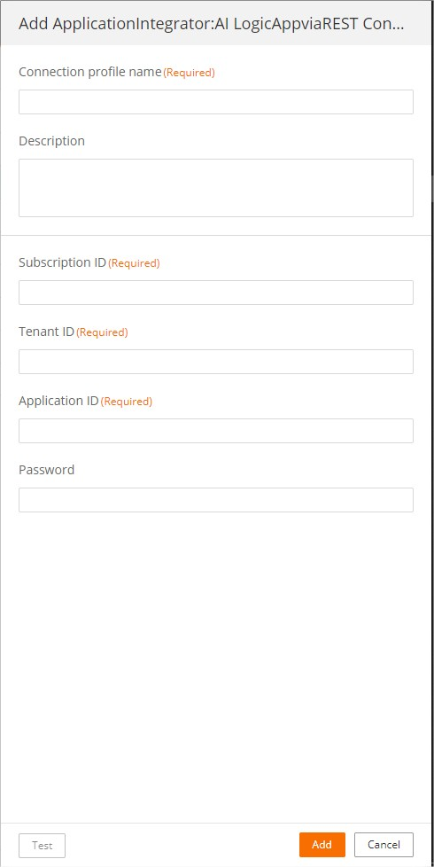
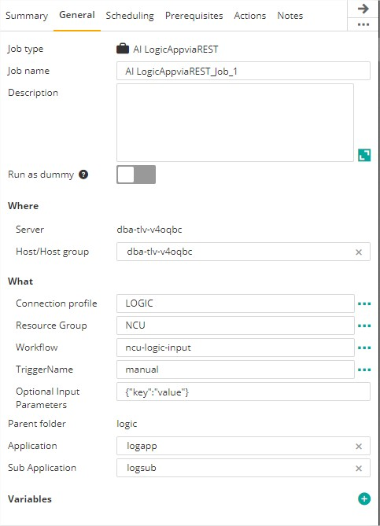
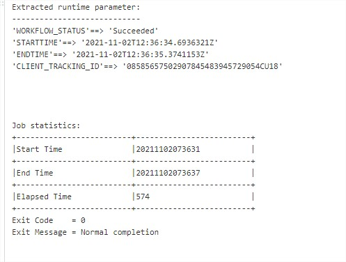

# Control-M Azure Logic Apps plugin
Version 1.0.0

### Short description:
Control-M Integration plugin for Azure Logic Apps.

Created on 02-Nov-2021

### Detailed description:

The Azure Logic Apps plugin for Control-M enables the integration of Logic Apps with your existing Control-M
workflows.

This folder contains sample Application Integrator jobtypes for running and monitoring Azure Logic Apps, a Microsoft Azure cloud service that helps to integrate apps, data, systems, and services across enterprises or organizations.

Trigger and monitor Logic Apps with this integration. Authentication can be handled by Service Principal
and Managed Identity.

#### Pre requisites

Control-M Version 9.21.000

#### Features

* #### 1. External application authentication.
* #### 2. Trigger Logic Apps workflow.
* #### 3. Monitor Logic Apps workflow in realtime.
* #### 4. Return the results of the workflow steps to the output in the Control-M Monitoring domain.
* #### 5. Integrate Logic apps processes with all existing Control-M capabilities.  

 
#### 1. Connection profile 




| Field | Value |
| --- | --- |
| Subscription ID	 | Azure subscription id of the Logic App you wish to run|
| Tenant ID	 | Azure tenant ID of the Logic App|
| Application ID	 | Azure App Registration (also known as Service Principal) that has permission to run the desired Logic App|
| Password	 | An active secret for the Application ID above (Client Secret)|

#### 2. Locig Apps Job Definition - Trigger workflow with parameters.
Once a connection profile is selected, you can use the elipsis (...) next to each field to retrieve from Azure the available values for each field and you can select the desired one from the list.



#### 3. Return the results of the workflow steps to the output in the Control-M Monitoring domain.  




#### Automation API input requirements
Variants of Connection profile information
```json
{
"LOGIC": {
    "Type": "ConnectionProfile:ApplicationIntegrator:AI LogicAppviaREST",
    "AI-Subscription ID": "<AI-Subscription ID>",
    "AI-Password": "*****",
    "AI-Application ID": "<AI-Application ID>",
    "AI-Tenant ID": "<AI-Tenant ID>",
    "Description": "",
    "Centralized": true
  }
}
```

Job Definition
```json
{
  "LogicParam": {
    "Type": "SimpleFolder",
    "ControlmServer": "dba-tlv-v3xham",
    "OrderMethod": "Manual",
    "AI LogicAppviaREST_Job": {
      "Type": "Job:ApplicationIntegrator:AI LogicAppviaREST",
      "ConnectionProfile": "LOGIC",
      "AI-Resource Group": "NCU",
      "AI-Workflow": "ncu-logic-input",
      "AI-TriggerName": "manual",
      "AI-Optional Input Parameters": "{\"key\":\"value\"}",
      "SubApplication": "logicsubapp",
      "Host": "dba-tlv-v3xham",
      "CreatedBy": "emuser",
      "RunAs": "LOGIC",
      "Application": "logicapp",
      "When": {
        "WeekDays": [
          "NONE"
        ],
        "MonthDays": [
          "ALL"
        ],
        "DaysRelation": "OR"
      }
    }
  }
}
```

 

