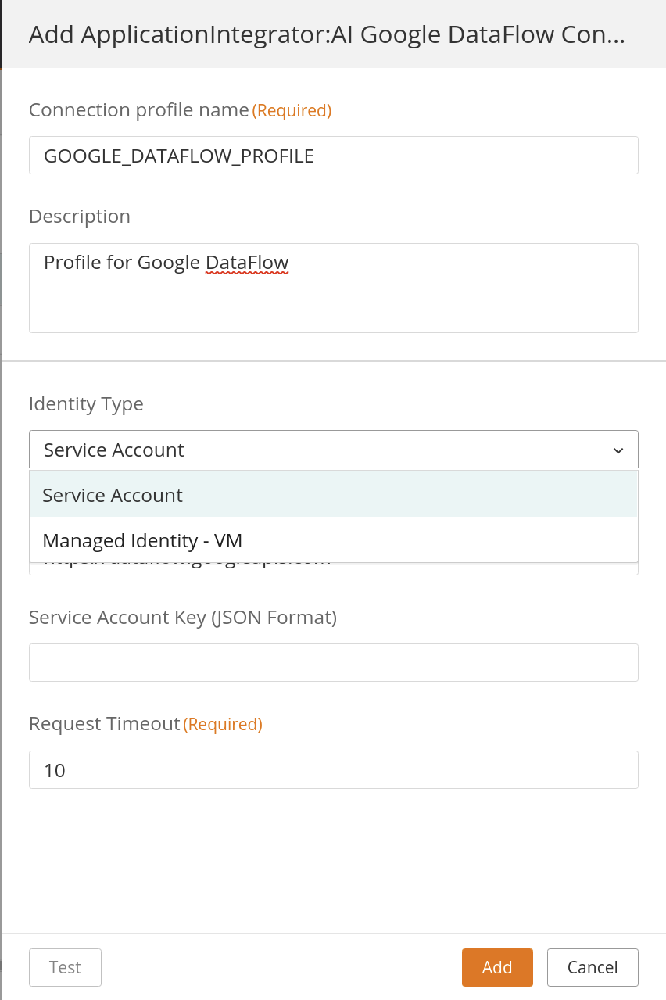
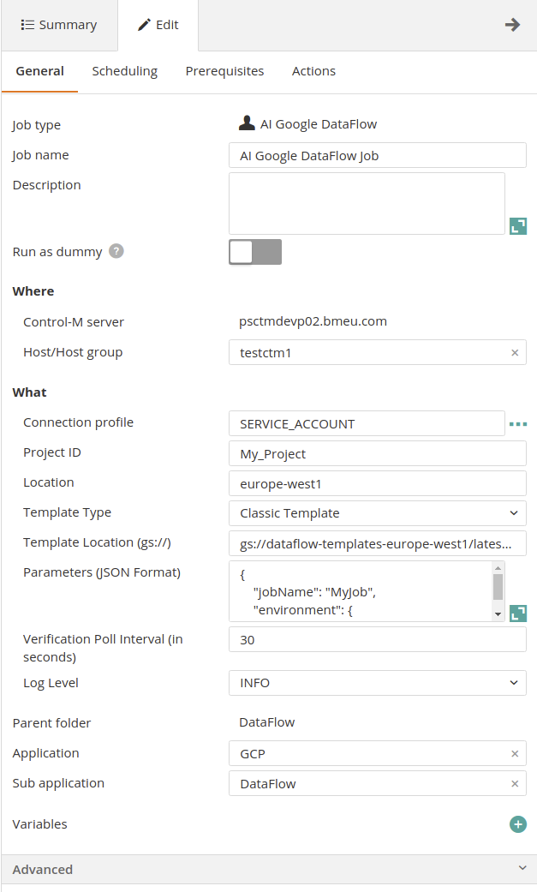
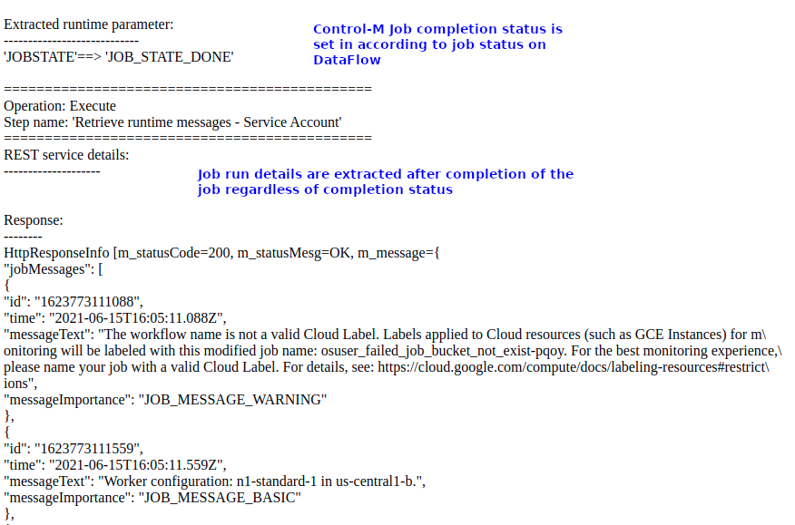

# Control-M Google DataFlow plugin
Version 1.0.00

### Short description:
Control-M Integration plugin for Google DataFlow jobs.
 
### Detailed description:

The Google DataFlow plugin for Control-M enables the integration of Google DataFlow jobs with your existing Control-M
workflows.

Google DataFlow is a processing serverless engine, that can process data on batch or streaming. 
It allows users to run jobs based on templates, develop new templates and run, or create templates based on SQL.

Control-M integration with Google DataFlow allows triggering of new jobs based on any template (Classic or Flex) created on Google DataFlow.

Authentication can be handled by Service Principal and Managed Identity.

#### Pre requisites

Control-M Version 9.20.000,
Fixpack 9.0.20.100,
Application pack Patch 9.0.20.101

Note: This plugin is not compatible with bmc Helix Control-M

#### Features

* #### 1. Service Principal and Managed Identity Authentication 

* #### 2. Trigger jobs with parameters based any Template.

* #### 3. Return the results of the job steps to the output in the Control-M Monitoring domain.  

* #### 4. Integrate Google DataFlow runs with all existing Control-M capabilities.  
    For example : 
                   
        a. Have your job on DataFlow defined in JSON and managed by your cicd process.
        b. Attach SLA's to your pipeline.
        c. Wait for a b2b source to arrive and process it in an application and run a pipeline based on the outcome.
        d. Attach prior and post dependancy steps to your pipeline for a fully encompassed view of your environment.
        e. A single reference point for the entire lifecycle of your data, from creation to analytics.

* #### 5. Avoid connection timeouts and unnecessary job reruns

* #### 6. Provide scheduling to Google DataFlow to reduce Streaming costs
    Control-M integration with Google DataFlow will provide access to an enterprise level scheduler for your DataFlow jobs, eliminating the requirement to trigger streaming jobs for use cases that does not require real time processing. This can reduce largely the billing cost for DataFlow.
    For example:
        a. A job that copies data from Google Cloud Storage to BigQuery that is updated hourly or daily.
        b. Without Control-M it will require a streaming job or to manually setup a Google Scheduler API Request to DataFlow. On the first case, there will be a cost for running the engine even when there is no data being processed.
        c. With Control-M we can create an hourly/daily job to only spend resources on DataFlow when there is data to be processed.

 
