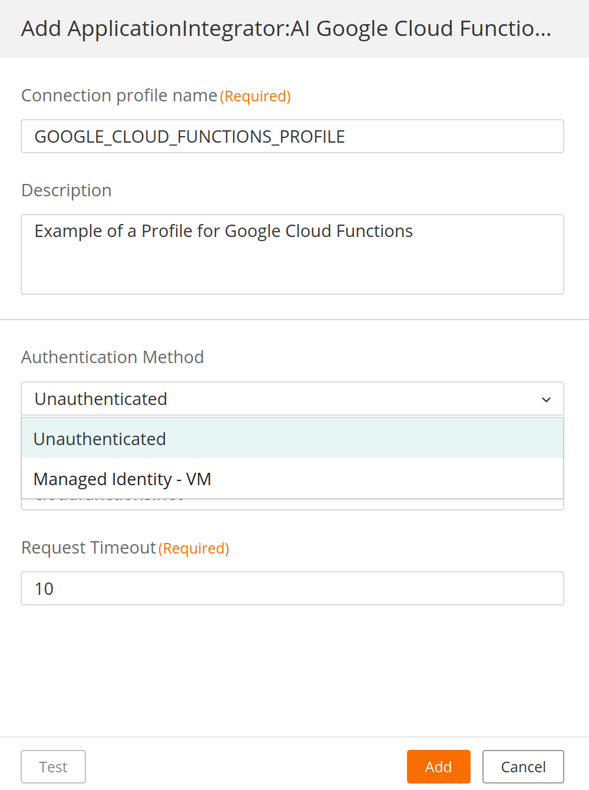
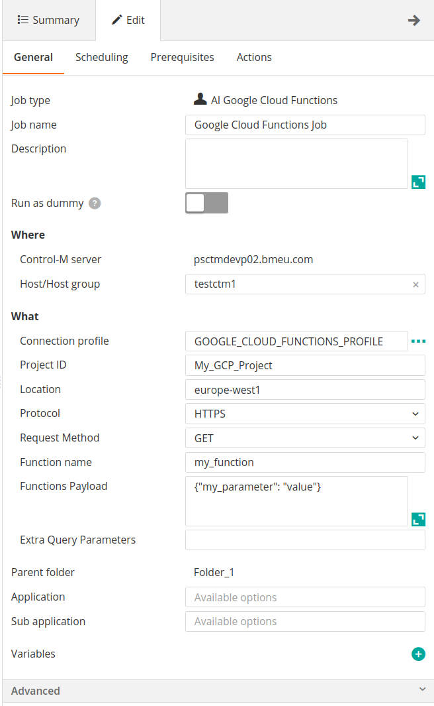
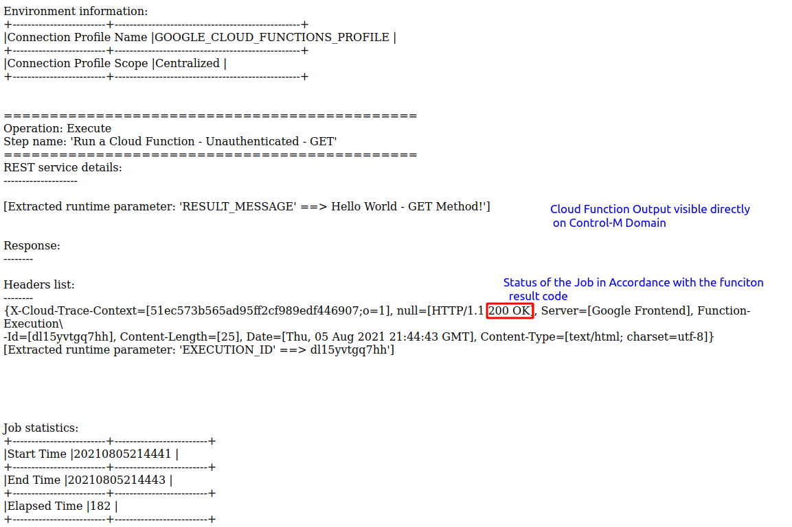

# Control-M Google Cloud Functions plugin
Version 1.0.00

### Short description:
Control-M Integration plugin for Google Cloud Functions jobs. 
 
### Detailed description:

The Google Cloud Functions plugin for Control-M enables the integration of Google Cloud Functions with your existing Control-M workflows.

Google Cloud Functions is a scalable pay-as-you-go functions as a service (FaaS) to run your code with zero server management. 
Its main features are:
•	No servers to provision, manage or upgrade.
•	Automatically scale based on the load.
•	Integrated monitoring, logging, and debugging capability.
•	Key networking capabilities for hybrid and multi-cloud scenarios

Control-M integration with Google Cloud Functions allows triggering of functions that use HTTP triggers.

This version supports only authentication on a Managed VM Identity or Unauthenticated functions.

#### Pre requisites

* Control-M Version 9.20.000
* Fixpack 9.0.20.100
* Application pack Patch 9.0.20.101

* Existent Cloud Function pre-configured
* HTTP Triggers are configured for the function that will be used
* APIs enabled for Google Cloud Functions
* Managed VM Identity with access to execute Cloud Function (minimum: Cloud Function Invoker)
* Control-M Agent installed on the Managed VM 
* Network connectivity between Control-M agent and Google Cloud Functions

Note: This plugin is not compatible with bmc Helix Control-M

#### Features

* #### 1. Unauthenticated and Managed VM Identity Authentication 

* #### 2. Trigger functions with all request methods 

* #### 3. Return the results of the job steps to the output in the Control-M Monitoring domain.  

* #### 4. Integrate Google Cloud Functions runs with all existing Control-M capabilities.  
    For example : 
                   
        a. Have your job on Cloud Function defined in JSON and managed by your cicd process.
        b. Attach SLA's to your pipeline.
        c. Wait for a b2b source to arrive and process it in an application and run a Cloud function based on the outcome.
        d. Attach prior and post dependancy steps to your Cloud function for a fully encompassed view of your environment.

* #### 5. Avoid connection timeouts and unnecessary job reruns

* #### 6. Provide scheduling to Google Cloud Functions 
    As Cloud Function is a FaaS (Function as a Service), it does not include the ability to schedule jobs. Control-M provides the ability to schedule functions, chaining multiple jobs to run based on the results of previous jobs. 
    
#### Authentication limitaton
    Control-M integration plugin for Google Cloud Functions supports functions that has HTTP Triggers using either authenticated or unauthenticated requests. 
    For authenticated requests, only Managed VM Identity is supported, Service Accounts are not supported by this plugin.
