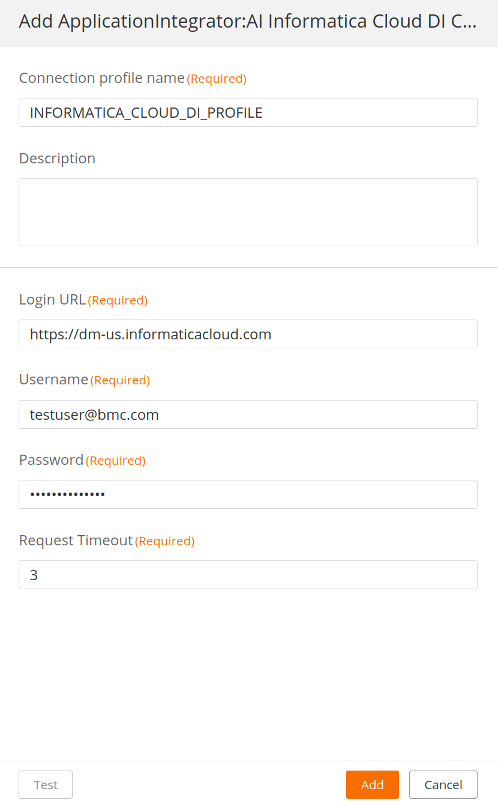
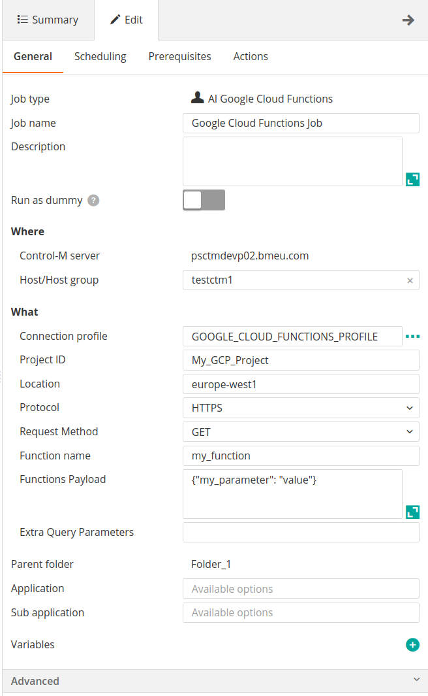
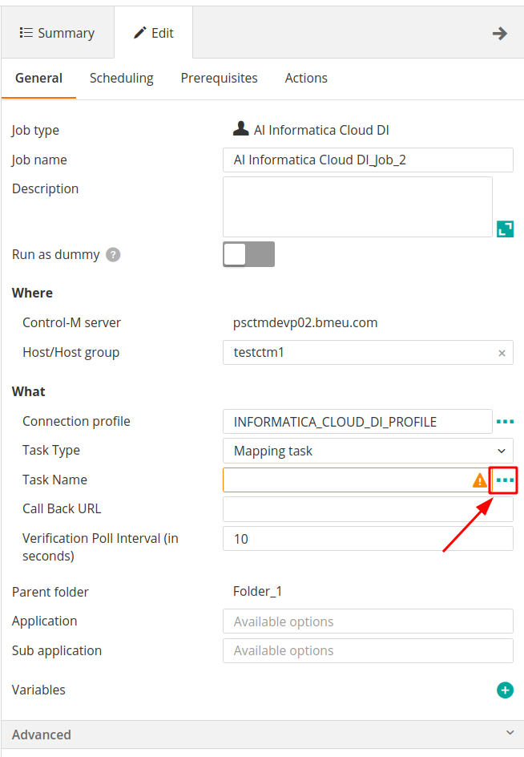
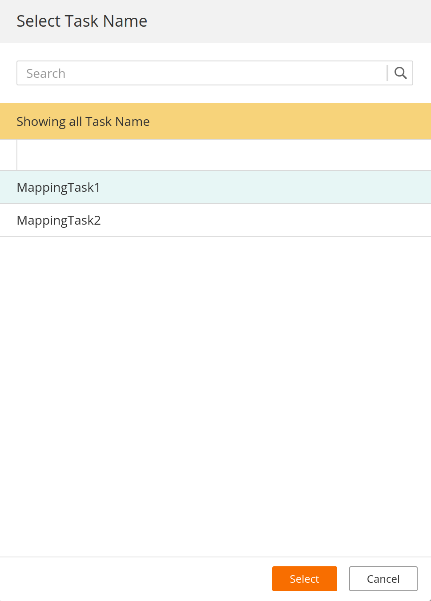
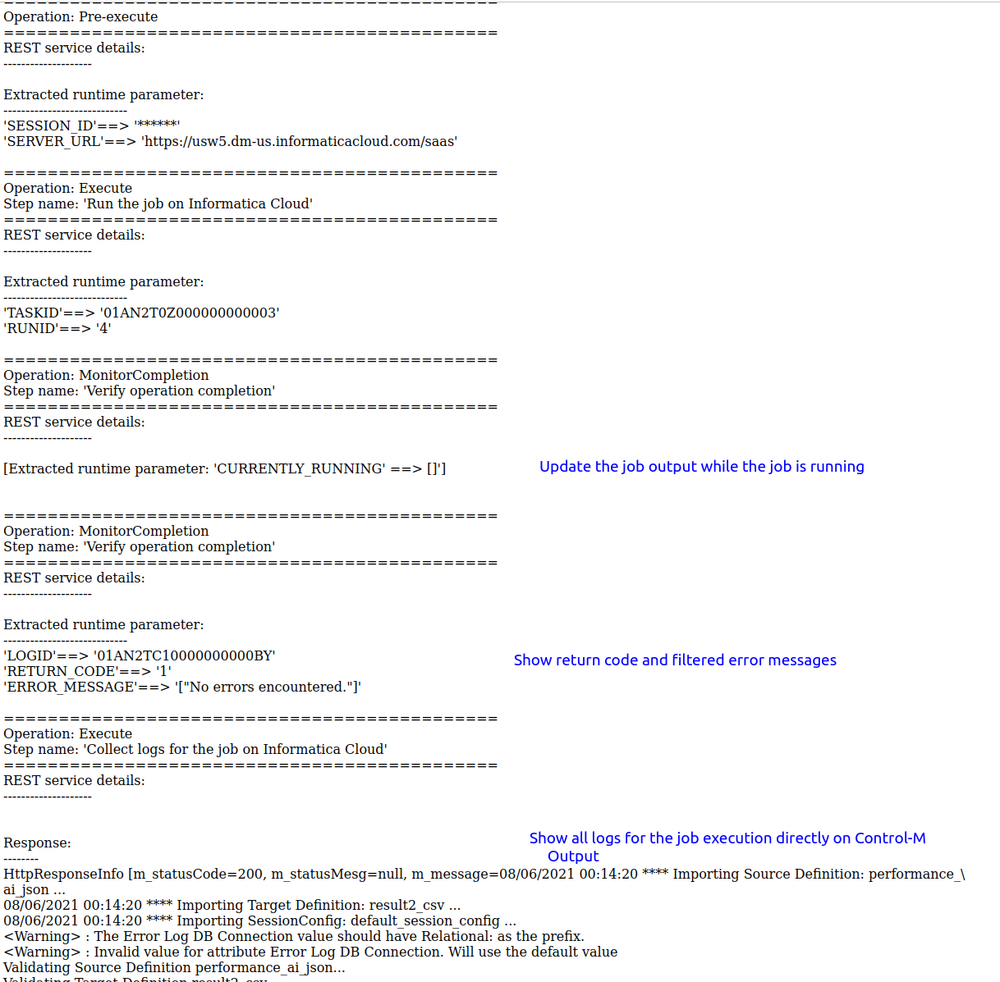

# Control-M Informatica Cloud Data Integration plugin
Version 1.0.00

### Short description:
Control-M Integration plugin for Informatica Cloud Data Integration tasks.
 
### Detailed description:

The Informatica Cloud Data Integration plugin for Control-M enables the integration of Informatica Cloud Data Integration with your existing Control-M workflows.

Informatica Cloud Data Integration is a cloud offer from Informatica to run Cloud ETL and Cloud ELT. It allows users to build and run advanced, complex integration and achieve elastic scale with Spark processing in a serverless environment.

Control-M integration with Informatica Cloud DI allows triggering of tasks on the Informatica Cloud platform.

This version supports authentication with Username and Password on the Informatica Cloud platform.

#### Pre requisites

* Control-M Version 9.20.000
* Fixpack 9.0.20.100
* Application pack Patch 9.0.20.101

* Existent tasks on Informatica Cloud DI
* User Account available with permissions to run tasks on Informatica Cloud
* Network connectivity between Control-M agent and Informatica Cloud

Note: This plugin is not compatible with bmc Helix Control-M

#### Features

* #### 1. Authnetication with Informatica Cloud DI

* #### 2. Run tasks from different task types

* #### 3. Load tasks names from Informatica Cloud to minimize chance of errors  

* #### 3. Return the results of the job steps to the output in the Control-M Monitoring domain.  

* #### 4. Integrate Informatica Cloud DI tasks with all existing Control-M capabilities.  
    For example : 
                   
        a. Have your task on Informatica Cloud DI defined in JSON and managed by your cicd process.
        b. Attach SLA's to your task.
        c. Wait for a b2b source to arrive and process it in an application and run a task on Informatica Cloud DI based on the outcome.
        d. Attach prior and post dependancy steps to your task for a fully encompassed view of your environment.

* #### 5. Avoid connection timeouts and unnecessary job reruns
