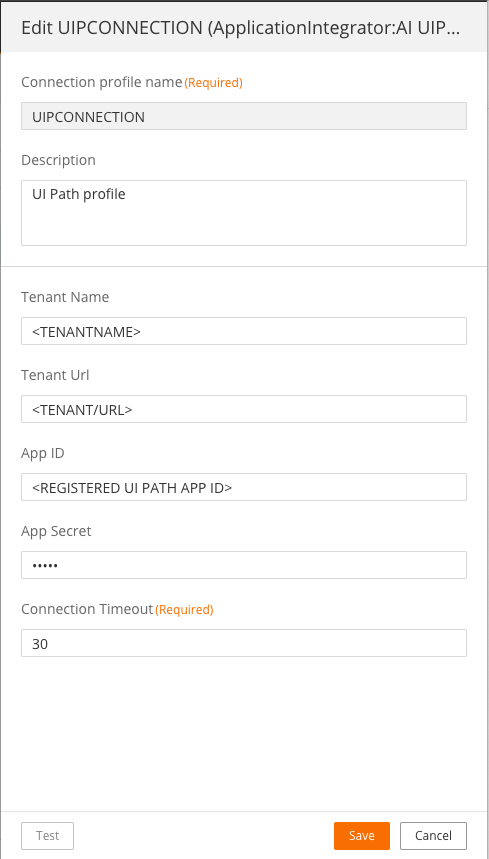
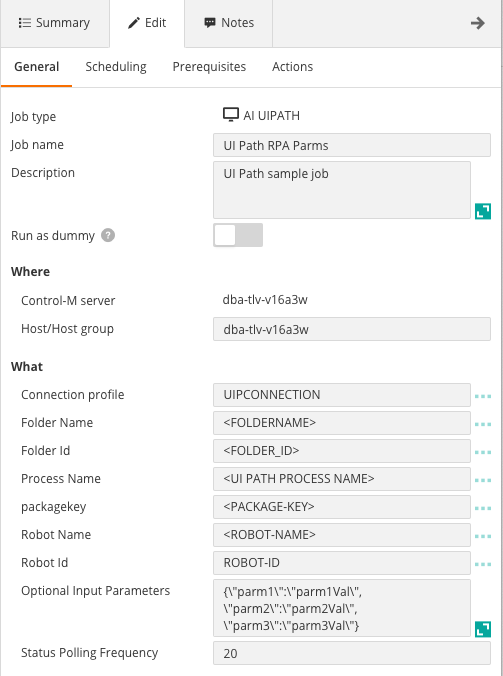

# Control-M UI Path plugin
Version 1.0.00

### Short description:
Control-M Integration plugin for UI Path (UiPath) RPAs.

Created on 13-Oct-2020
Updated on 13-Oct-2020
Updated on 27-Aug-2021
Updated on 20-Oct-2021

### Detailed description:

The UiPath plugin for Control-M enables the integration of UiPath RPAs with the rest of your application 
ecosystem, allowing for a true hyper automated application stack. True enterprise orchestration enables continuous SLA and business
process management.

UiPath is a cloud-based ETL and data integration service that allows you to create data-driven workflows 
for orchestrating data movement and transforming data at scale.

Hyper automation allows for orchestrating a multitude of steps across business processes. In the context of data RPAs
this means that a data source may be the start of a RPA but it is not the starting point of a business process.
A number of steps would be performed prior to a data RPA being triggered. Prior steps could be application based where the data 
source is generated as an output from the application. Automating the end to end process provides clear and decisive 
visibility and management of the entire ecosystem, bonding RPAs with supplying applications.

#### Pre requisites

Control-M Version 9.20.000,
Fixpack 9.0.20.100,
Application pack Patch 9.0.20.101

Note: This plugin is not compatible with bmc Helix Control-M

#### Features

* #### 1. External application authentication.

* #### 2. Trigger RPA processes with parameters.

* #### 3. Monitor UI Path processes in realtime.
  
* #### 4. Return the results of the RPA steps to the output in the Control-M Monitoring domain.  

* #### 5. Integrate UI Path processes with all existing Control-M capabilities.  
    For example : 
                   
        a. Have your RPA scheduled tasks defined in JSON and managed by your cicd process.          
        b. Attach SLA's to your RPA.
        c. Wait for a b2b source to arrive and process it in an application and run a RPA based on the outcome.
        d. Attach prior and post dependancy steps to your RPA for a fully encompassed view of your environment.
        e. A single reference point for the entire lifecycle of your data, from creation to analytics.

* #### 6. Avoid connection timeouts and unnecessary RPA reruns by way of resource management.

#### Authentication

#### Connection profile

    ===== UI Path Connection Profile Fields Description =====

| Field | Value |
| --- | --- |
| Connection Profile Name | The name of the connection profile |
| Tenant Name | UI Path Tenant Name |
| Tenant Url | UI Path Tenant Url. |
| App ID | UI Path External App ID. See the following link on how to define a confidential external app in UI Path Orchestrator. Note the following application scopes were used for this integration. (OR.Folders OR.Execution OR.Jobs OR.Robots OR.Administration OR.Monitoring) https://docs.uipath.com/automation-cloud/docs/managing-external-applications#providing-details-to-developers |
| App Secret | Generated when defining an external app. |
| Connection Timeout | Process trigger time-out in seconds. This will set the response wait limit for starting a process  |

#### UI Path Job Definition

    ===== UI Path Job Fields Description =====

| Field | Value |
| --- | --- |
| Connection Profile | The name of the predefined connection profile containing authentication detail that was defined in the connection profile step
| Folder Name | The name of the folder containing the UI Path process to run. Click the Load button for dynamic listing |
| Folder Id | The Folder Id of the selected Folder Name. Click the Load button for dynamic listing |
| Process Name | The process to execute. Click the Load button for dynamic listing |
| packagekey | The unique package key information. Click the Load button for dynamic retrieval |
| Robot Name | The robot name where the process should run. Click the Load button for dynamic listing |
| Robot Id | . The robot id associated with the Robot Name selected above. Click the Load button for dynamic retrieval |
| Optional Input Parameters | Runtime parameters in the format {\\"parm1\\":\\"parm1Val\\",\\"parm2\\":\\"parm2Val\\"} |
| Status Polling Frequency | The polling time in seconds that your job status should be verified
