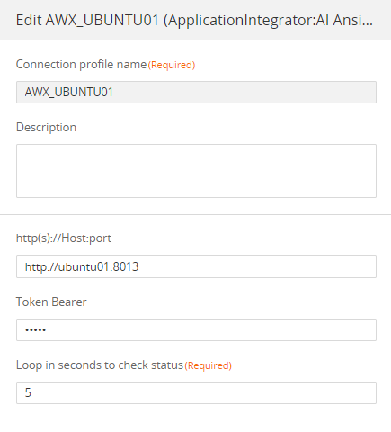
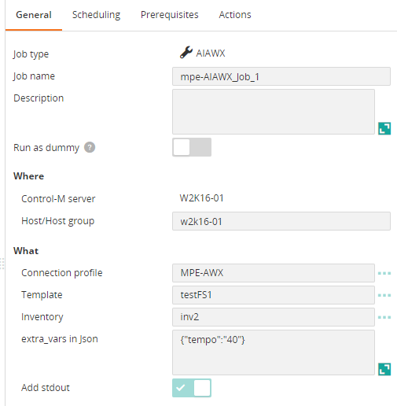
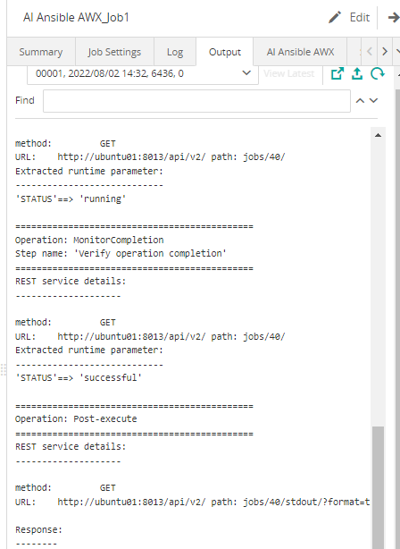

# Control-M Ansible-AWX plugin
## Changes on this version

| Date | Who | What |
| - | - | - |
| 2022-07-18 | Mathieu Petit | First release |
| 2022-10-05 | Mathieu Petit | Add Manual abort operation step, add Text box with load button to display Templates and Inventories |

## Contributions

| Date | Who | What |
| - | - | - |

## Short description:
Control-M Integration plugin for Ansible AWX.
It triggers AWX Template on AWX Inventory, monitors the completion and get the playbooks output.

## Prerequisites

- Control-M Version 9.20.000,
- Control-M Application pack 9.20
- Tested on AWX v21.

## Installation

- Deploy the integration AI Ansible AWX.ctmai using Application Integrator.
 
## Detailed description:

The job proceeds with these steps:
- Get the template Id
- Get the inventory Id
- Trigger the template on the invenory and create a Job in AWX
- Monitor the completion of the job.
- Display the playbook output.
 

## Control-M

* #### 1. Connection Profile 

It is a Bearer authentication.
Specify the token.

* #### 2. Define a job

Enter the AWX Template and the target AWX Inventory.

* #### 3. Output

