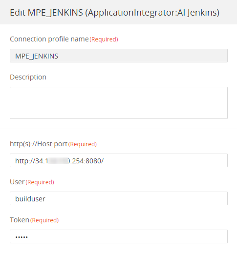
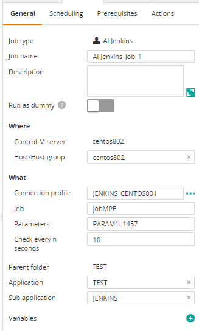
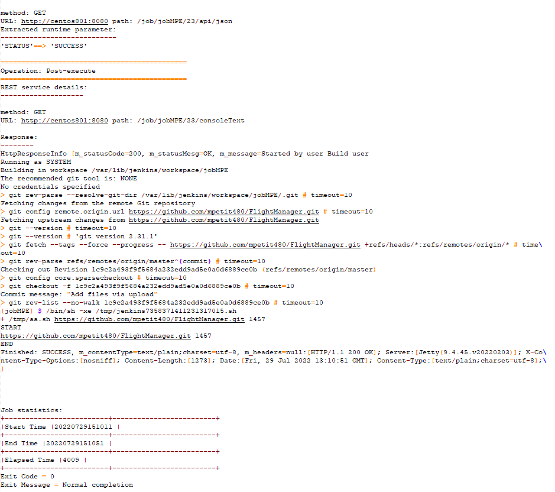

# Control-M Jenkins plugin
## Changes on this version

| Date | Who | What |
| - | - | - |
| 2022-07-18 | Mathieu Petit | First release |
| 2022-10-04 | Mathieu Petit | Add a Text Box with Load Button to display the list of Jenkins jobs |

## Contributions

| Date | Who | What |
| - | - | - |

## Short description:
Control-M Integration plugin for Jenkins

## Prerequisites

- Control-M Version 9.20.000,
- Control-M Application pack 9.20
- Tested on Jenkins 2.34

## Installation

- Deploy the integration AI Jenkins.ctmai using Application Integrator.
 
## Detailed description:

The job proceeds with these steps:
- Get the Next Build number of the Jenkins job
- Trigger the build and pass parameters
- Monitor the completion of the job (Jenkins statuses : SUCCESS, FAILURE, UNSTABLE, ABORTED)
- Display the Build output
 

## Control-M

* #### 1. Connection Profile 

It is a Basic authentication.
Specify user:passwd  or user:token encoded in base64.

* #### 2. Define a job

Paramters are optional. The format is:

PARAM1=value&PARAM2=value&PARAM3=value

* #### 3. Output

