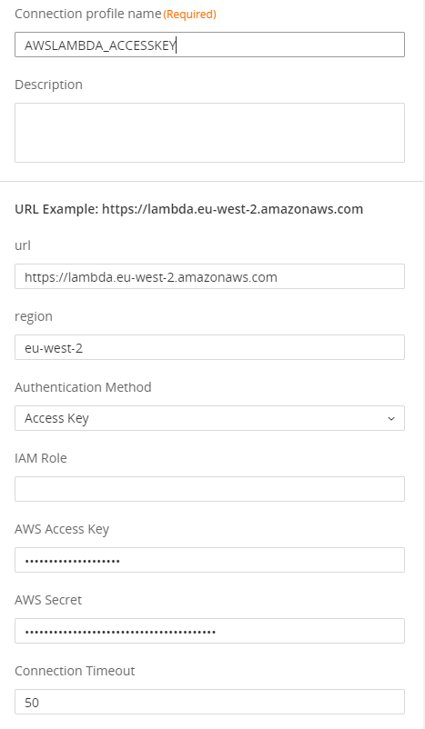
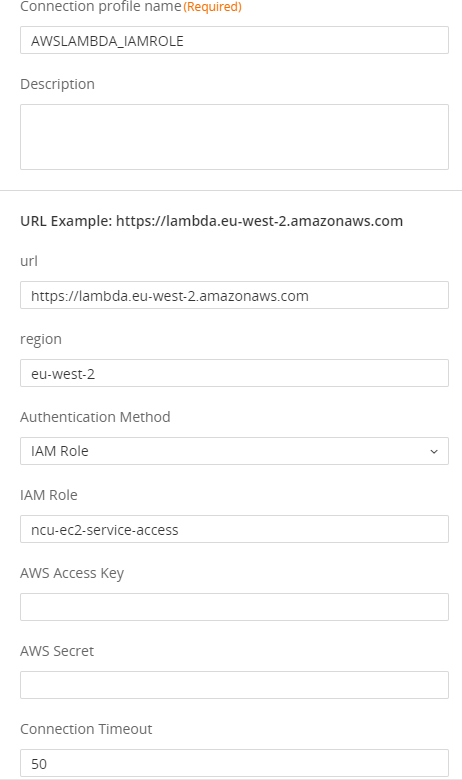
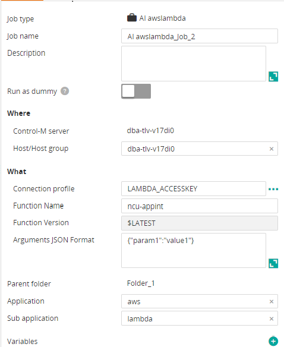
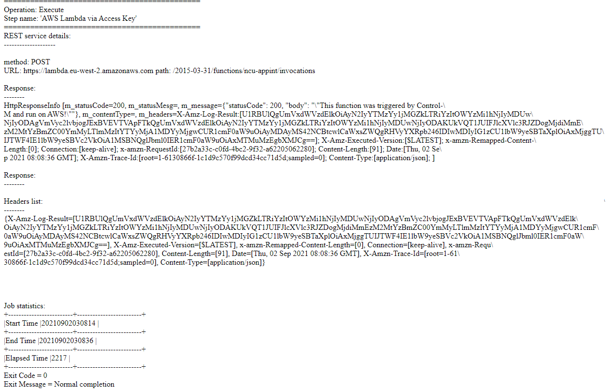

# Control-M AWS Lambda plugin
Version 1.0.00

### Short description:
Control-M Integration plugin for AWS Lambda.
 
### Detailed description:
AWS Lambda is a serverless compute service where you can write and run code without server management.
AWS Lambda plugin for Control-M enables the integration of AWS Lambda functions with the rest of your application 
ecosystem.
The Lambda function is invoked synchronously by the plugin.
You can trigger the lambda function from Control-M with arguments (JSON format) or with no parameters and then enter {}.

### Authentication
When working with services on AWS infrastructure, IAM role authentication is addressed (AssumeRole).
When working outside of AWS infrastructure, authentication is via access key id and secret key (SigV4).

#### Pre requisites

Control-M Version 9.20.000,
Fixpack 9.0.20.100,
Application pack Patch 9.0.20.101

Note: This plugin is not compatible with bmc Helix Control-M

#### Features

* #### 1. Principal account and IAM 





* #### 2. Trigger function with arguments.

Note: Arguments is a mandatory field. When no arguments Enter {}



* #### 3. Return the result of the function to the output in the Control-M Monitoring domain.  



* #### 4. Integrate AWS Lambda functions runs with all existing Control-M capabilities.  
    For example : 
                   
        a. Have your workflow tasks defined in JSON and managed by your cicd process.          
        b. Attach SLA's to your workflow.
        c. Wait for a b2b source to arrive and process it in an application and run a workflow based on the outcome.
        d. Attach prior and post dependancy steps to your workflow for a fully encompassed view of your environment.
        e. A single reference point for the entire lifecycle of your data, from creation to analytics.

* #### 5. Automation API Connection Profile samples

##### Using IAM Role
```

"AWS_IAMROLE": {
    "Type": "ConnectionProfile:ApplicationIntegrator:AI awslambda",
    "AI-IAM Role": "iam-role-name",
    "AI-AWS Access Key": "*****",
    "AI-AWS Secret": "*****",
    "AI-region": "aws-region",
    "AI-url": "lambda-url",
    "AI-Connection Timeout": "50",
    "AI-Authentication Method": "IAMROLE",
    "Description": "",
    "Centralized": true
  },
```
#####  Using access key and secret
```

  {
  "AWS_ACCESSKEY": {
    "Type": "ConnectionProfile:ApplicationIntegrator:AI awslambda",
    "AI-AWS Access Key": "*****",
    "AI-AWS Secret": "*****",
    "AI-region": "aws-region",
    "AI-url": "lambda-url",
    "AI-Connection Timeout": "50",
    "AI-Authentication Method": "ACCESSKEY",
    "Description": "",
    "Centralized": true
  }

```

* #### 6. Automation API JSON job sample

```

  "folderName": {
    "Type": "SimpleFolder",
    "ControlmServer": "SERVER",
    "OrderMethod": "Manual",
    "AI awslambda_Job_name": {
      "Type": "Job:ApplicationIntegrator:AI awslambda",
      "ConnectionProfile": "AWS_ACCESSKEYS",
      "AI-Function Name": "function-name",
      "AI-Arguments : JSON format": "{}",
      "SubApplication": "lambda",
      "Host": "SERVER",
      "RunAs": "AWS_ACCESSKEYS",
      "Application": "aws"
    }
  


```


