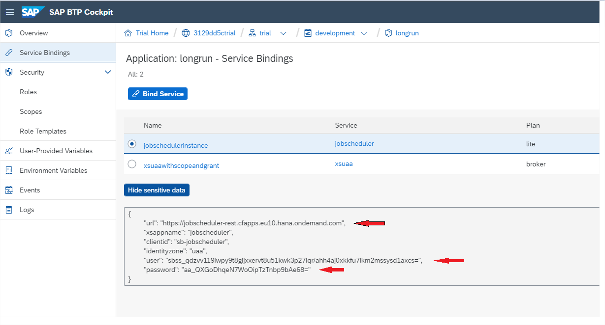
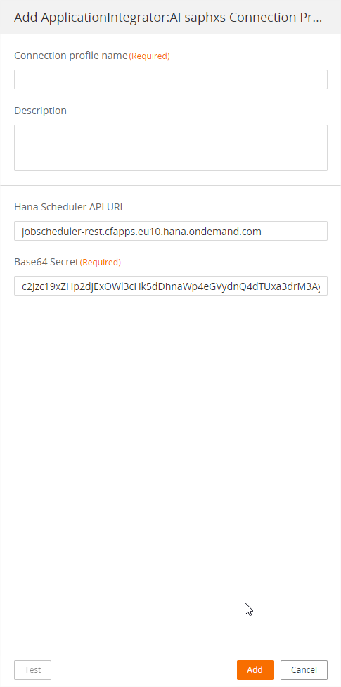
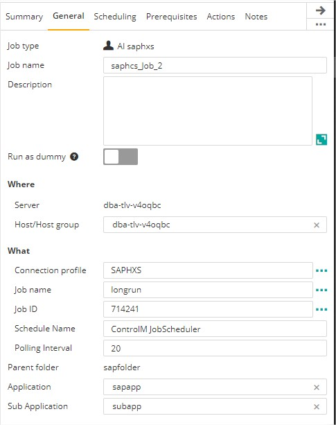

# Control-M Sap Hana Cloud Job Scheduler plugin
Version 1.0.00

### Short description:
Control-M Integration plugin for SAP Hana Job Scheduling Service, This service runs in the Cloud Foundry environment.
Job Scheduler is a tool that allows to define jobs, schedule to run regularly, trigger REST endpoints

Created on 13-Oct-2021

#### Use case
Long Running Processes i.e IT Process -Integrating with a 3rd party,Enterprise Process – Order fulfillment etc<br>
In such case, Control-M does NOT wait for the response of the called endpoint, Such scenario has to be executed in ASYNCHRONOUS way.<br>
This means: Control-M can Invoke JObJobscheduler triggers an app’s endpoint, Once the app is done, it calls sort of callback to inform Jobscheduler about the finished job that updated Control-M <br>
  
#### Pre requisites

Control-M Version 9.20.000,
Fixpack 9.0.20.200,
Application pack Patch 9.0.20.200
1.	Ability to access to SAP Cloud Platform, Trial or productive landscape
3.	This integration with SAP HANA will only work if the instance of JobScheduler service plan is “Lite”
4.	The application must be bound with instance of JobScheduler and Authorization & Trust Management (XSUAA)
    For more detail please review [this link](https://blogs.sap.com/2020/04/23/using-job-scheduler-in-sap-cloud-platform-5-long-running-async-jobs/) as an example for creating a sample application and bind it to the instances 
    Note: The example in the link shows how to connect using Oauth2.0 but the connection here is via basic authentication, for more detail please review this SAP document 
5.	After the binding the make sure the credentials details appear under the Job scheduler


#### Features

* #### 1. External application authentication.
* #### 2. Trigger Sap Hana Job Scheduler processes.
* #### 3. Monitor Sap Hana Job Scheduler in realtime.
* #### 4. Return the results of the Job Scheduler steps to the output in the Control-M Monitoring domain.
* #### 5. Integrate Sap Hana processes with all existing Control-M capabilities.  
 
#### Connection profile




    ===== UI Path Connection Profile Fields Description =====


| Field | Value |
| --- | --- |
| Connection Profile Name | The name of the connection profile |
| Hana Scheduler API URL | URL parameter from section 5 of the Prerequisites <br> https://jobscheduler-rest.cfapps.eu10.hana.ondemand.com|
| Base64 Secret | user:password encoded in base64 <br> How to create it: Go to https://www.base64encode.org/ <br>Don’t forget to add **colon** between the user and the password |

#### Sap Hana Job Definition




    ===== Sap Hana Job Fields Description =====


| Field | Value |
| --- | --- |
| Connection Profile | The name of the predefined connection profile containing authentication detail that was defined in the connection profile step
|Job Name |	The name of the job that you wish to execute.
|Job ID |	Check to include Arguments in the Arguments Field.|
|Scheduler Name| Set the Scheduler Name |
Polling Interval | (Optional) Default 20. The polling time in seconds that your job status should be tracked. |

#### Automation API input requirements
Variants of Connection profile information
```json
{
"SAPHXS": {
 	"Type": "ConnectionProfile:ApplicationIntegrator:AI saphxs",
 	"AI-Hana Scheduler API URL": "jobscheduler-rest.cfapps.eu10.hana.ondemand.com", 
 	"AI-Base64 Secret": "{base64(user:password)}",
 	"Description": "",
  	"Centralized": true
  	}
}
```

Job Definition
```json
{
    "Type": "SimpleFolder",
    "ControlmServer": "dba-tlv-uyw8nc",
    "OrderMethod": "Manual",
    "AI saphcs_Job_2": {
 	"Type": "Job:ApplicationIntegrator:AI saphxs",
 	"ConnectionProfile": "SAPHXS",
               "AI-Schedule Name": "ControlM JobScheduler",
 	"AI-Job name": "longrun",
 	"AI-Job ID": "714241",
 	"SubApplication": "sapsub",
 	"Host": "dba-tlv-uyw8nc",
 	"CreatedBy": "emuser",
 	"RunAs": "SAPHXS",
 	"Application": "sapapp",
 	"When": {
 		"WeekDays": [
 		"NONE"
 		],
    "saphxs": {
        "MonthDays": [
        "ALL"
        ],
    "DaysRelation": "OR"
    }
  }
 }
}

```

