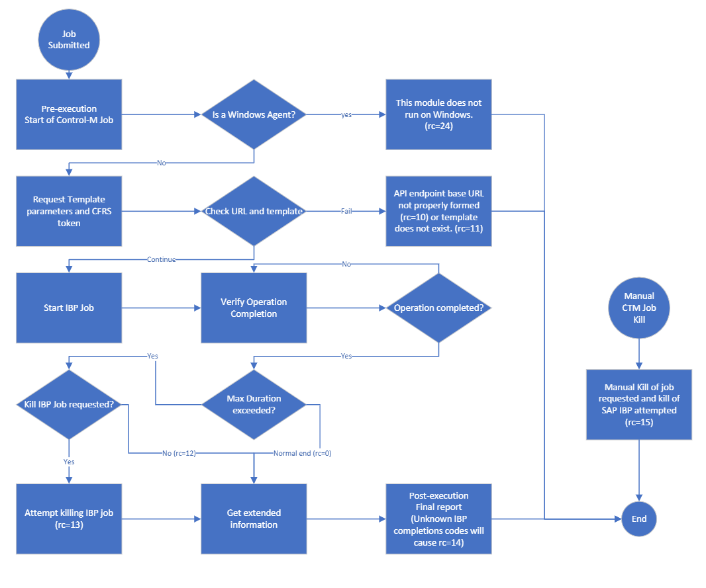

# Control-M SAP IBP plugin

First Release: 19-Jan-2022

## Short description

Control-M Integration plugin for SAP IBP.

>* For the latest SAP IBP information, refer to SAP Notes:
>   * 2503171 - Usage of External Job Scheduling solutions with SAP Integrated Business Planning
>   * 2789802 - IBP - Common JOB issues when using external scheduler

## Download 

* [Click this to download a zip of the PlugIn jobtype](resources/AI_SAPIBP.zip) 
   Click download and unzip the archive. Then, import the file into the Application Integrator designer.
* [Click this for the uncompressed raw AI_SAPIBP.ctmai file](resources/AI_SAPIBP.ctmai) 
   This will allow you to retrieve the raw ctmai file as described in the repository [Readme](https://github.com/controlm/integrations-plugins-community-solutions#saving-application-integrator-files-for-use).
  
## Pre requisites

### Control-M

* Helix Control-M
* Helix Control-M Agent v9.0.20.180+ **only on Linux**.
* Application pack v9.0.20.180+

> NOTE: It is likely compatible with Control-M on-premise systems, but it has not yet been tested with it.

### SAP IBP

Uses the published [SAP IBP API](resources/ExternalJobScheduling_Official.pdf)

## Features

* Authentication: Uses Basic Authentication
* Connection Profile:
  * Includes a configurable cycle time to avoid overloading the SAP IBP platform with excessive verification requests (default=60 seconds)
* Job Fields
  * Can be specified with a choice of the Template Name or the Template Text. Most users know the Template Text, but the API requires the Template Name to start the job.
    * Allows to specify the Maximum Duration (timeout) expected on each job.
        If the jobs surpasses the Maximum Duration, you can select to attempt to kill the SAP IBP job, or let it continue. 
        In either case, you should validate, per the SAP IBP API manual, that all components have completed. 
        See OData Call to Cancel / Unschedule a Job on the [API documentation](resources/ExternalJobScheduling_Official.pdf)
* Return Codes
  * rc=0: IBP Reported completion successfully. JobStatus="F".
    * rc=10: URL for SAP IBP is malformed. Likely cause it is missing the "-api".
    * rc=11: The Template Text or Name specified could not be found.
    * rc=12: The execution in SAP IBP still continues after Control-M job ended. Likely a timeout without a request for termination. JobStatus="R".
    * rc=13: The execution in SAP IBP terminated with JobStatus=A. The job was cancelled in SAP IBP, or a timeout with termination occurred. JobStatus="A".
    * rc=14: There was an unknown return code (JobStatus different from A, F, or R)
    * rc=15: The job was manually killed from Control-M. An attempt to terminate the SAP IBP job was automatically sent.
    * rc=24: An attempt to run on a **Windows agent** made the job fail.

## Test information

### Test Jobs provided

* [See Sample JSON Test Jobs](resources/AI_SAP_IBP_Test_Jobs.json)

### Sample CCP provided

* [See Connection Profile](resources/AI_SAP_IBP_CP.json)

## Overall flow for the plugin

[Download PDF](images/AppInt_Flow.pdf)

