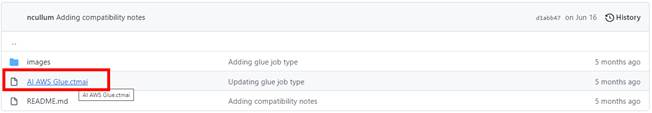
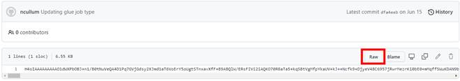
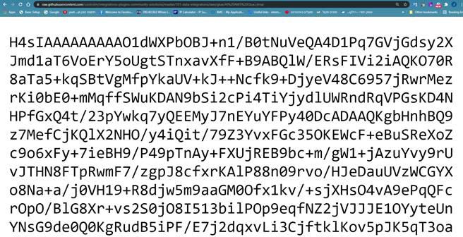
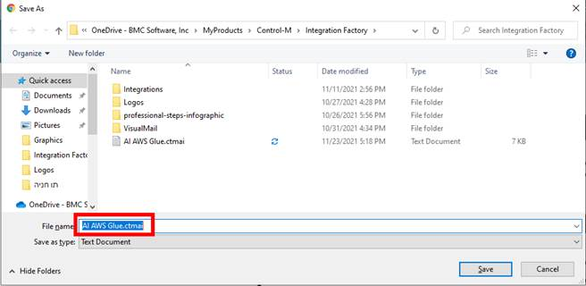
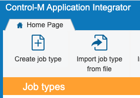

# Control-M custom integrations plugins community solutions

This repository contains community built application integrations for Control-M Application Integrator.  

## Compatibility Note

Please check individual integrations README files for Control-M version and application compatibility 

## Contribution guide
To contribute, please follow these guidelines.

### Files, folders and naming conventions
1. Every sample and its associated files must be contained in its own **folder**. Name this folder something that describes what your sample does. Usually this naming pattern looks like **level-sample-purpose** (e.g. 201-data-vendor-integration). Numbering should start at 101. 100 is reserved for things that need to be at the top.

      For consistent categorization, please comply to the following folder structure:
      + 101-vertical-integrations
      + 102-data-integrations
      + 103-robotic-process-solution-integrations
      + 104-bot-integration-integrations
      + 105-controlm-automation-api-integrations

2. For consistent ordering **create all folders in lowercase**.
3. Include a **README.md** file that explains the sample. A good description helps other community members to understand your sample. The README.md uses [Github Flavored Markdown](https://guides.github.com/features/mastering-markdown/) for formatting text. If you want to add images to your README.md file, store the images in the **images** folder. Reference the images in the README.md with a relative path (e.g. ``). This ensures the link will reference the target repository if the source repository is forked.

### Saving Application Integrator files for use

1. Go to the specific file you want to download
   

2. In the file page, click on the “Raw” button
   

3. click Ctrl+S and save

   ##### Note: When saving, remove the .txt extension and change it to .ctmai

4. Import from Control-M Application Integrator designer

## Questions/Feedback
Please use issues on GitHub for questions or feedback about the examples included in this repository.
